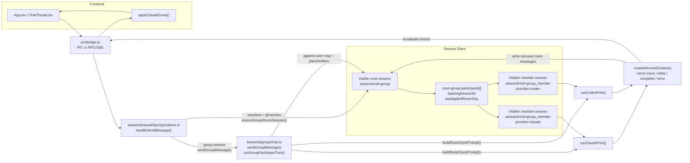

```mermaid
flowchart LR
  subgraph F["Frontend"]
    UI["App.tsx / ChatThread.tsx"]
    APPLY["applyClaudeEvent()"]
  end

  BR["src/bridge.ts\nIPC or RPC/SSE"]
  RPC["backend/claudeRpcOperations.ts\nhandleSendMessage()"]

  subgraph S["Session Store"]
    ROOM["Visible room session\nsessionKind=group"]
    PART["room.group.participants[]\nbackingSessionId\nlastAppliedRoomSeq"]
    CLAUDE["Hidden member session\nsessionKind=group_member\nprovider=claude"]
    CODEX["Hidden member session\nsessionKind=group_member\nprovider=codex"]
  end

  GROUP["backend/groupChat.ts\nsendGroupMessage()\nrunGroupParticipantTurn()"]
  MIRROR["createMirroredContext()\nmirror trace / delta / complete / error"]
  CLAUDE_RUN["runClaudePrint()"]
  CODEX_RUN["runCodexPrint()"]

  UI --> BR --> RPC
  RPC -->|"standard + @mention\nensureGroupRoomSession()"| ROOM
  RPC -->|"group session\nsendGroupMessage()"| GROUP
  ROOM --> PART
  PART --> CLAUDE
  PART --> CODEX
  GROUP -->|"append user msg + placeholders"| ROOM
  GROUP -->|"buildRoomSyncPrompt()"| CLAUDE_RUN
  GROUP -->|"buildRoomSyncPrompt()"| CODEX_RUN
  CLAUDE --> CLAUDE_RUN
  CODEX --> CODEX_RUN
  CLAUDE_RUN --> MIRROR
  CODEX_RUN --> MIRROR
  MIRROR -->|"write mirrored room messages"| ROOM
  MIRROR -->|"broadcast events"| BR --> APPLY --> UI

```