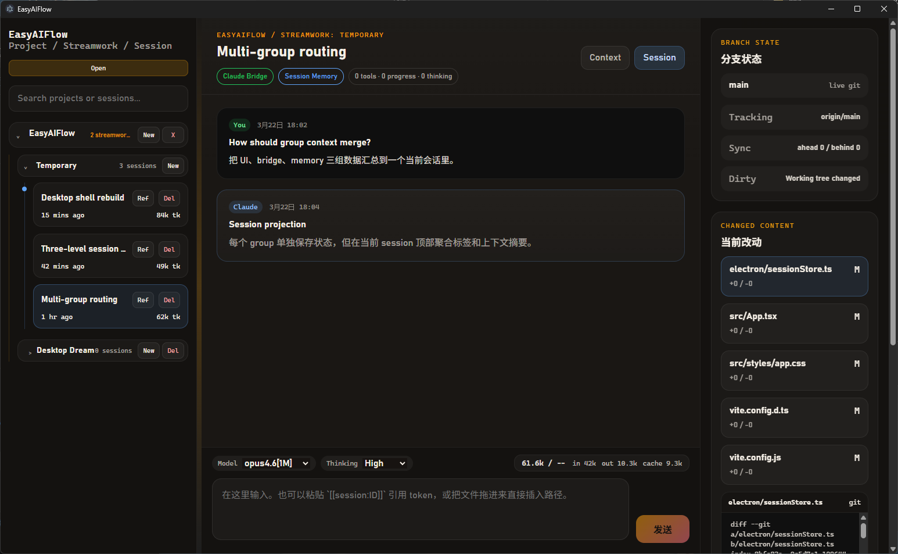

# EasyAIFlow

> 面向本地 AI 编码工作流的桌面/Web 客户端，支持 Claude 与 Codex 双 provider、普通会话、Group Chat、交互式控制与本地历史导入。
>
> A desktop/web client for local AI coding workflows with dual Claude/Codex providers, standard sessions, group chat rooms, interactive control, and native history import.



---

## 目录 / Table of Contents

- [功能亮点 / Features](#功能亮点--features)
- [多 Provider 会话 / Multi-provider Sessions](#多-provider-会话--multi-provider-sessions)
- [群聊房间 / Group Rooms](#群聊房间--group-rooms)
- [交互式对话系统 / Interactive Dialog System](#交互式对话系统--interactive-dialog-system)
- [双运行时架构 / Dual Runtime Architecture](#双运行时架构--dual-runtime-architecture)
- [技术栈 / Tech Stack](#技术栈--tech-stack)
- [快速开始 / Getting Started](#快速开始--getting-started)
- [命令参考 / Commands](#命令参考--commands)
- [项目结构 / Project Structure](#项目结构--project-structure)
- [数据模型 / Data Model](#数据模型--data-model)
- [License](#license)

---

## 功能亮点 / Features

### 中文

- **双 provider 架构**：同一个应用里同时支持 Claude 与 Codex，会话级切换而不是分裂成两套产品
- **三层会话结构**：Project → Streamwork → Session，便于按项目和任务线组织上下文
- **Group Chat 房间**：可在同一房间中用 `@claude`、`@codex`、`@all` 定向对话，让两个 provider 共用一条可见时间线
- **实时流式与工具追踪**：支持流式文本、状态更新、trace、代码变更 diff、Token 用量与运行态展示
- **Codex resident app-server**：Codex 会话可保持常驻线程，支持后续 turn 复用与断开控制
- **交互式控制**：Claude 会话支持 Permission Request、Plan Mode、Ask User Question 三类暂停机制
- **上下文引用**：通过 `[[session:id]]` / `[[streamwork:id]]` 引用其他会话历史，支持摘要或全文模式
- **原生历史导入与清理**：可导入本地 Claude/Codex 历史；重命名、删除时会同步清理对应原生记录
- **桌面 + Web 双运行时**：同一套业务逻辑支持 Electron 桌面模式和 HTTP/SSE Web 模式

### English

- **Dual-provider architecture**: Claude and Codex live inside one app, with per-session routing instead of two separate products
- **Three-tier session hierarchy**: Project -> Streamwork -> Session for organizing work by project and task line
- **Group chat rooms**: Use `@claude`, `@codex`, and `@all` in one visible room timeline shared by both providers
- **Streaming and trace visibility**: Progressive text, status updates, tool traces, recorded diffs, token usage, and runtime state
- **Resident Codex app-server**: Codex sessions can keep a live thread around for follow-up turns and controlled disconnects
- **Interactive control**: Claude sessions support Permission Request, Plan Mode, and Ask User Question pauses
- **Context references**: Reuse prior work with `[[session:id]]` / `[[streamwork:id]]`, in summary or full-history mode
- **Native import and cleanup**: Import local Claude/Codex history and keep native stores in sync on rename/delete
- **Desktop + Web dual runtime**: The same business logic runs in Electron desktop mode and HTTP/SSE web mode

---

## 多 Provider 会话 / Multi-provider Sessions

### 中文

EasyAIFlow 的核心不是单一 CLI 包装，而是**按 session 路由的 provider runtime**：

- **Claude 标准会话**：通过 Claude CLI 运行，支持 streaming、权限审批、Plan Mode、Ask User Question、BTW 面板
- **Codex 标准会话**：通过 `codex app-server` 运行，支持 resident thread、命令 trace、函数调用 trace、代码变更记录
- **统一前端事件模型**：无论底层是 Claude 还是 Codex，后端都会归一化为统一的 `ClaudeStreamEvent` 事件流，前端只消费一套状态机

典型流程：

```text
用户消息
  -> bridge.ts
  -> backend 解析 session kind / provider
     -> Claude runtime
     -> Codex app-server runtime
     -> 或 group room fan-out
  -> 统一事件流 (delta / status / trace / complete / error ...)
  -> React UI 实时更新
```

### English

EasyAIFlow is not just a thin CLI wrapper. It is a **session-routed provider runtime layer**:

- **Claude standard sessions** run through Claude CLI with streaming, permission review, plan-mode approval, Ask User Question, and the BTW panel
- **Codex standard sessions** run through `codex app-server` with resident threads, command traces, function-call traces, and recorded code changes
- **Unified frontend events** keep the UI on a single event model even though Claude and Codex have different native runtimes

---

## 群聊房间 / Group Rooms

### 中文

Group Room 是当前版本里最重要的新能力之一。它的实现不是简单把两段文本拼在一起，而是：

- 房间本身是一个**可见 session**，`sessionKind = group`
- 每个参与者都有一个**隐藏 backing session**，`sessionKind = group_member`
- Claude backing session 保留 Claude 原生上下文
- Codex backing session 保留 Codex thread / app-server 上下文
- 房间消息按 `seq` 编号，并记录 `speakerLabel`、`targetParticipantIds`、trace 与完成态

使用方式：

- `@claude`：只让 Claude 回答
- `@codex`：只让 Codex 回答
- `@all`：让两边都回答
- 不写 `@`：默认回给上一个成功回应的参与者

### English

Group rooms are backed by real session state, not just prompt tricks:

- The room itself is a **visible session** with `sessionKind = group`
- Each participant owns a **hidden backing session** with `sessionKind = group_member`
- Claude keeps Claude-native session continuity
- Codex keeps Codex thread/app-server continuity
- Room messages track `seq`, `speakerLabel`, `targetParticipantIds`, traces, and completion state

Targeting rules:

- `@claude` -> Claude only
- `@codex` -> Codex only
- `@all` -> both participants
- no `@` -> fall back to the last successful responder

---

## 交互式对话系统 / Interactive Dialog System

### 中文

Claude 在执行过程中可以暂停并请求用户输入，EasyAIFlow 当前支持三种交互机制：

| 类型 | 触发场景 | 用户操作 |
|------|---------|---------|
| **Permission Request** | Claude 需要访问文件或执行命令 | 允许 / 拒绝（支持路径级持久授权） |
| **Plan Mode** | Claude 进入计划模式等待审批 | 批准 / 修订 / 手动执行 |
| **Ask User Question** | Claude 发起单选或多选问题 | 选择答案并可附加备注 |

补充说明：这些交互式控制目前是 **Claude runtime** 能力；Codex runtime 侧重点是 resident thread、trace 和 group-room 协同。

### English

Claude sessions can pause and request user input through three mechanisms:

| Type | Trigger | User Action |
|------|---------|-------------|
| **Permission Request** | Claude needs file or command access | Allow / Deny, with path-level persistence |
| **Plan Mode** | Claude pauses for plan approval | Approve / Revise / Execute manually |
| **Ask User Question** | Claude asks single- or multi-choice questions | Select answers and add optional notes |

Note: these interactive controls currently belong to the **Claude runtime**. The Codex runtime focuses on resident threads, traces, and group-room coordination.

---

## 双运行时架构 / Dual Runtime Architecture

### 中文

```text
┌────────────────────────────────────────────────────────────┐
│                    React 前端 (src/)                        │
│            bridge.ts 自动适配 Desktop / Web 运行时          │
└───────────────┬──────────────────────────┬─────────────────┘
                │                          │
       ┌────────▼────────┐        ┌────────▼─────────┐
       │  Electron IPC    │        │ HTTP JSON-RPC +  │
       │  preload + main  │        │ SSE events       │
       │  桌面模式         │        │ Web 模式         │
       └────────┬────────┘        └────────┬─────────┘
                │                          │
       ┌────────▼──────────────────────────▼────────┐
       │                backend/                     │
       │ Claude runtime · Codex app-server runtime  │
       │ group chat orchestration · persistence      │
       └────────────────────────────────────────────┘
```

### English

```text
┌────────────────────────────────────────────────────────────┐
│                    React Frontend (src/)                    │
│          bridge.ts auto-selects Desktop / Web runtime       │
└───────────────┬──────────────────────────┬─────────────────┘
                │                          │
       ┌────────▼────────┐        ┌────────▼─────────┐
       │  Electron IPC    │        │ HTTP JSON-RPC +  │
       │  preload + main  │        │ SSE events       │
       │  Desktop mode    │        │ Web mode         │
       └────────┬────────┘        └────────┬─────────┘
                │                          │
       ┌────────▼──────────────────────────▼────────┐
       │                backend/                     │
       │ Claude runtime · Codex app-server runtime  │
       │ group orchestration · persistence           │
       └────────────────────────────────────────────┘
```

---

## 技术栈 / Tech Stack

| 层级 / Layer | 技术 / Technology |
|---|---|
| 前端 / Frontend | React 19, React Markdown, Remark GFM, Vite 7 |
| 桌面 / Desktop | Electron 37, Electron Builder (NSIS) |
| 后端 / Backend | Node.js 20+, TypeScript 5.9 (strict), tsx |
| Provider Runtime | Claude CLI, Codex CLI, `codex app-server` |
| 通信 / Communication | NDJSON normalization, IPC (desktop), JSON-RPC + SSE (web) |
| 持久化 / Persistence | Local JSON store + native Claude/Codex history import |

---

## 快速开始 / Getting Started

### 前置要求 / Prerequisites

- Node.js 20+
- npm 10+
- 本地可用的 `claude` CLI（Claude 会话需要）/ A working local `claude` CLI for Claude sessions
- 本地可用的 `codex` CLI（Codex 会话和 Group Room 需要）/ A working local `codex` CLI for Codex sessions and group rooms
- Windows（桌面模式）/ Any OS（Web 模式）

### 安装 / Install

```bash
git clone https://github.com/ZachZeng99/EasyAIFlow.git
cd EasyAIFlow
npm install
```

### 启动开发 / Start Development

```bash
# 桌面模式（Electron + Vite）/ Desktop mode
npm run dev

# Web 模式（HTTP 服务 + Vite）/ Web mode
npm run dev:web
```

默认情况下，Vite 前端运行在 `4273` 端口，Web 服务运行在 `8887` 端口。可通过 `EASYAIFLOW_WEB_CLIENT_PORT` 和 `EASYAIFLOW_WEB_SERVER_PORT` 覆盖。

By default, the Vite client runs on port `4273` and the web server runs on port `8887`. Override them with `EASYAIFLOW_WEB_CLIENT_PORT` and `EASYAIFLOW_WEB_SERVER_PORT`.

---

## 命令参考 / Commands

| 命令 / Command | 说明 / Description |
|---|---|
| `npm run dev` | 启动桌面开发（Vite + Electron）/ Start desktop dev (Vite + Electron) |
| `npm run dev:web` | 启动 Web 开发（Vite + HTTP 服务）/ Start web dev (Vite + HTTP server) |
| `npm run dev:web:client` | 仅启动 Vite 前端（默认端口 4273）/ Vite frontend only (default port 4273) |
| `npm run dev:server` | 仅启动 Web 后端（默认端口 8887）/ Web server only (default port 8887) |
| `npm run check` | TypeScript 类型检查（`tsc -b`）/ Type check all configs |
| `npm run build` | 完整构建：类型检查 + Vite + Electron / Full build |
| `npm run build:web` | Web 构建：类型检查 + Vite + 服务端 / Web-only build |
| `npm run package:win` | 构建 + 打包 Windows NSIS 安装程序 / Build + Windows installer |
| `npm run start:web` | 运行已构建的 Web 服务 / Run built web server |

---

## 项目结构 / Project Structure

```text
EasyAIFlow/
├── src/                          # React 前端 / Frontend
│   ├── App.tsx                   # 主状态与事件归并 / Main state + event reducer
│   ├── bridge.ts                 # Desktop/Web runtime abstraction
│   ├── components/               # Chat UI, dialogs, history, context, BTW
│   └── data/                     # Shared types and pure UI/domain logic
├── backend/                      # Shared runtime logic
│   ├── claudeInteraction.ts      # Claude runtime
│   ├── codexAppServer.ts         # Codex app-server client/process manager
│   ├── codexAppServerTurn.ts     # Codex resident turn execution
│   ├── codexInteraction.ts       # Codex trace/event normalization
│   ├── groupChat.ts              # Group room orchestration
│   └── providerSessionRuntime.ts # Provider routing for standard sessions
├── electron/                     # Electron main-process code
│   ├── main.ts                   # IPC handlers
│   ├── preload.cts               # Context bridge
│   ├── sessionStore.ts           # Persistent store + native import/recovery
│   └── workspacePaths.ts         # Native workspace/session path helpers
├── server/
│   └── server.ts                 # Web JSON-RPC + SSE runtime
├── tests/                        # Self-contained tests run with tsx
├── AGENTS.md                     # Repo instructions for coding agents
├── CLAUDE.md                     # Claude Code development notes
└── package.json
```

---

## 数据模型 / Data Model

```text
ProjectRecord[]
  └─ DreamRecord[]                  # Streamworks
     └─ SessionSummary[]
        ├─ standard                 # Claude or Codex one-on-one session
        ├─ group                    # Visible group room
        ├─ group_member             # Hidden room backing session
        └─ ConversationMessage[]    # Room or session messages
```

Group rooms carry participant metadata, message sequence numbers, target mentions, and mirrored provider replies/traces. Hidden `group_member` sessions preserve each provider's own native continuity while keeping the room timeline unified.

---

## License

MIT — see [LICENSE](./LICENSE).
